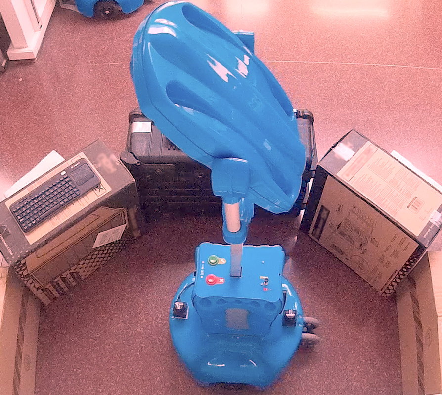
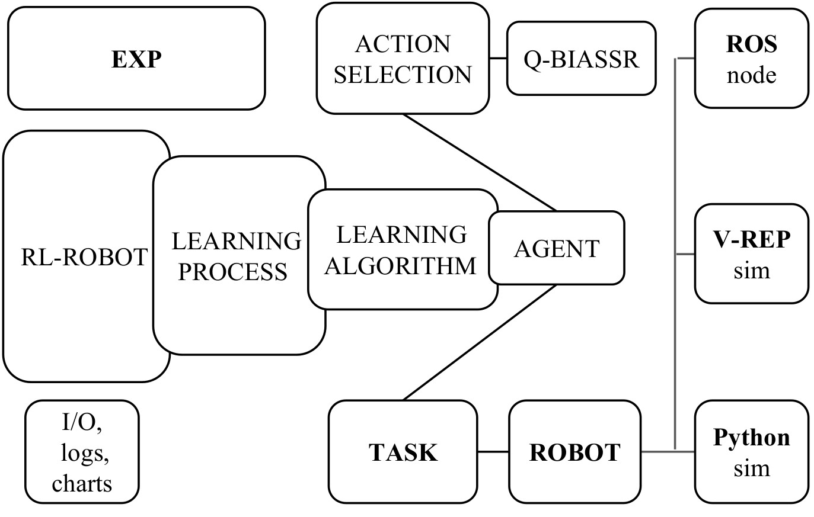
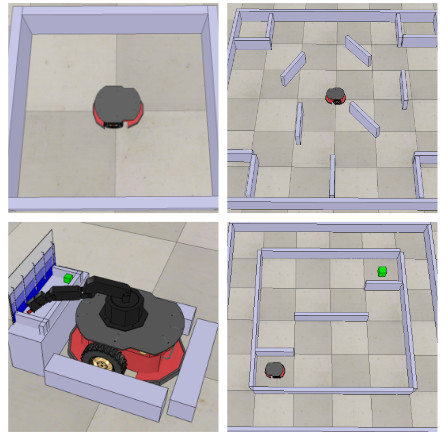

# RL-ROBOT

Ángel Martínez-Tenor - 2016



This repository provides a Reinforcement Learning framework in Python from the Machine Perception and Intelligent Robotics research group [(MAPIR)](http://mapir.isa.uma.es).
 
Reference: *Towards a common implementation of reinforcement learning for multiple robotics tasks*. &nbsp; [Arxiv preprint](https://arxiv.org/abs/1702.06329) &nbsp;&nbsp;
[ScienceDirect](http://www.sciencedirect.com/science/article/pii/S0957417417307613) 





## Getting Started

**Setup**
- Create a python environment and install the requirements. e.g. using conda:

```
conda create -n rlrobot python=3.10
conda activate rlrobot
pip install -r requirements.txt
# tkinter: sudo apt install python-tk 
```
**Run**
- Execute ```python run_custom_exp.py``` (content below)


~~~
import exp
import rlrobot

exp.ENVIRONMENT_TYPE = "MODEL"   # "VREP" for V-REP simulation
exp.TASK_ID = "wander_1k"
exp.FILE_MODEL = exp.TASK_ID + "_model"

exp.ALGORITHM = "TOSL"
exp.ACTION_STRATEGY = "QBIASSR"
 
exp.N_REPETITIONS = 1
exp.N_EPISODES = 1
exp.N_STEPS = 60 * 60

exp.DISPLAY_STEP = 500

rlrobot.run()
~~~
- Full set of parameters available in `exp.py` 

- Tested on Ubuntu 14,16 ,18, 20 (64 bits)


## V-REP settings: 
Tested: V-REP PRO EDU V3.3.2 / V3.5.0




1. Use default values of `remoteApiConnections.txt`
    ~~~
    portIndex1_port 		= 19997
    portIndex1_debug 		= false
    portIndex1_syncSimTrigger 	= true
    ~~~

2. Activate threaded rendering (recommended):
    `system/usrset.txt -> threadedRenderingDuringSimulation = 1` 

Recommended simulation settings for V-REP scenes:

* Simulation step time: 50 ms  (default) 
* Real-Time Simulation: Enabled
* Multiplication factor: 3.00 (required CPU >= i3 3110m)

 **Execute V-REP** 
 (`./vrep.sh on linux`). `File -> Open Scene -> <RL-ROBOT path>/vrep_scenes` 
